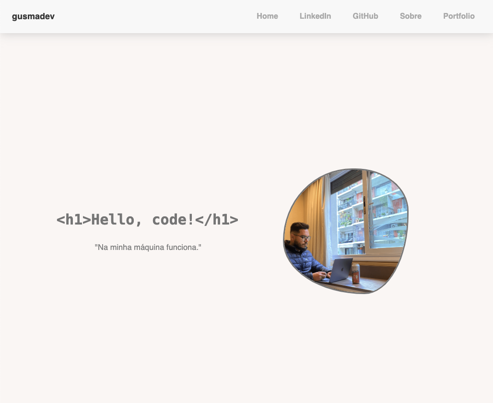

# GusmaDev Personal Page

Welcome to GusmaDev's personal page! This website serves as a showcase for my projects, skills, and interests.



## Table of Contents
- [Introduction](#introduction)
- [Features](#features)
- [Technologies Used](#technologies-used)
- [Usage](#usage)
- [Contributing](#contributing)
- [License](#license)

## Introduction
This personal page is designed to give visitors a glimpse into who I am as a developer and the projects I've worked on. Whether you're a potential employer, colleague, or just someone interested in what I do, I hope you find something of interest here!

## Features
- Home page with brief introduction and links to other sections
- Projects showcase with descriptions and links
- Contact form for reaching out

## Technologies Used
- HTML5
- CSS3
- JavaScript

## Usage
To view the website, simply visit [https://gusmadev.com](https://gusmadev.com) in your web browser.

If you want to explore the code or contribute to the project, you can clone the repository:
```bash
git clone https://github.com/yourusername/gusmadev-personal-page.git
